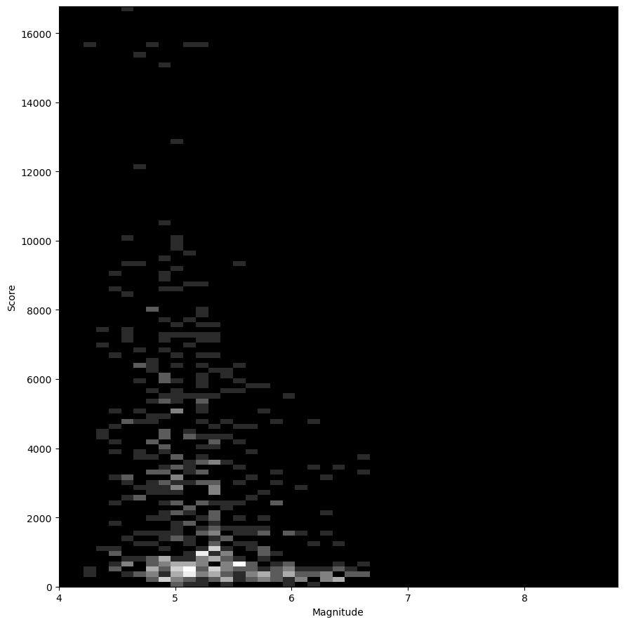

<a name="readme-top"></a>

<div align="right">
  <a>
    
  </a>

</div>

<details>
  <summary>Table of Contents</summary>
  <ol>
    <li>
      <a href="#about-the-project">About The Project</a>
      <ul>
        <li><a href="#rbkt-group-members">RBKT Group Members</a></li>
        <li><a href="#initial-project-proposal">Initial Project Proposal</a></li>
          <ul>
            <li><a href="#project-motivation">Project Motivation</a></li>
            <li><a href="#research-objectives">Research objectives</a></li>
      </ul>
    </li>
    <li>
      <a href="#datasets">Datasets</a>
      <ul>
        <li><a href="#dataset-choice">Dataset Choice</a></li>
        <li><a href="#dataset-examples">Dataset Examples</a></li>
        <li><a href="#dataset-features-description">Dataset Features Description</a></li>
        <li><a href="#dataset-exploration-and-filtering">Dataset Exploration and Filering</a></li>
        <li><a href="#clusters-database">Clusters Database</a></li>
      </ul>
    </li>
    <li><a href="#decision-trees">Decision Trees</a></li>
    <li><a href="#neural-networks-and-cnns">Neural Networks and CNNs</a></li>
      <ul>
        <li><a href="#convolutional-neural-networks">Convolutional Neural Networks</a></li>
        <li><a href="#multi-layer-perceptron">Multi-Layer Perceptron</a></li>
      </ul>
    <li><a href="#conclusion">Conclusion</a></li>
  </ol>
</details>

<!-- _nb: some of the text has been written in french and translated through NLP artificial intelligence tools as none of us is native english speaker_

<!-- _we talk about clusters in general. However, sometimes we will talk about clusters of cells, and other times, clusters of earthquakes. The clusters of cells are only in the spatial dimension, while the clusters of earthquakes are in spatio-temporal (ST) dimensions._ -->

<p align="right">(<a href="#readme-top">back to top</a>)</p>

# Earthquakes Clustering and Aftershocks Signature Analysis

# About The Project

## RBKT Group Members

1. BARAT Benjamin @milnerLFC H00443657
2. BENGRINE Abdelkarim @AbdelkarimBENGRINE H00447727
3. BOUTEMY Théo @theoboutemy H00440904
4. RAMDANI Reda @Reda-R H00450690
5. PICHOT Luc @Luc-Pichot H00445072


## Initial Project Proposal

Explore USGS natural hazard's data to identify earthquakes clusters, in order to study the spatio-temporal and magnitude relationship between a Mainshock and its Aftershock Sequence.

## Project Motivation
<p align="justify">
  8th of September, Morocco : A earthquake of moment magnitude ≃ 6.8 sadly kills more than 3 000 persons and affect another 300 000 over the whole country area. That's another demonstration of how dangerous is this phenomena, and why efforts should be invested in trying to understand their behavior.
  If predicting the exact occurrence of an isolated main shock remains a scientific frontier that we, as of now, deem nearly impossible, we can focus our efforts on another aspect: studying aftershocks. Aftershocks are the seismic tremors that follow a main shock and often carry their own potential for destruction. The study of earthquakes turns out to be as complex as fascinating. Thanks to the United States Geological Survey (USGS : https://www.usgs.gov/), we can collect data and work on it in an attempt to give sense to data points that basically seem to have none.
</p>

<!--
- Replicas of shockwaves prediction
- Magnitude prediction
- Depth prediction
- Prediction of aftershock events
- NEURAL NETWORK LUC specific problem/hypothesis
-->

<p align="justify">
The study of earthquakes is fascinating, but there are many ethical and human factors involved. Indeed, there is a great responsibility on earthquake prevention equipment in view of the potential victims of these natural phenomena. We have sparingly collected data and trained our models to generate AIs that are in tune with the real world. It is therefore part of a learning dynamic. We would like to emphasize that our project is currently intended for educational purposes only, and should not be used in real-life situations.
</p>

### Research objectives
* Data Preprocessing:
  - Challenge : Explore the raw available data and extract the main features that can be used in the context of our machine learning project.
  - Clean and preprocess raw earthquake data extracted from USGS, visualise some results throught different plots that help a non-expert to understand the problem.
  - Use mathematical laws (statistical analysis) to justify some of our decisions.

* Earthquakes Clustering :
  - Challenge : Group spatio temporal shocks together with unsupervised learning methods as the data is not labelized
  - Use searching tree or graph data structures thanks to feature engineering and smart data reduction (purely in the sense of reducing the number of data points and reducing the computation time) methods.
  - Create a new earthquakes database thanks to this process to have a solid basis for predictive models.

* Aftershock Prediction with Decision Trees:
 - Challenge : Predict and calculate whether a mainshock will be followed by at least one aftershock of magnitude greater than 5 within a month.
  - Using decision tree classifier we can try to break down the complex data structure of -quite- random events.
  - Evaluate the models accuracy

* Artificial Neural Networks (ANN) for Aftershock Analysis:
  - Challenge : Find different patterns among the different earthquakes clusters features such as their location, magnitude, depth, aftershock sequence...
  - Implement a new way to visualize aftershock signatures from a mainshock.
  - Investigate the spatial distribution of aftershocks to retrieve location (categorial) information.
  - Evaluate the accuracy of the predictive neural networks models in predicting aftershock occurrences.

* Performance Metrics:
  - Challenge : Evaluate the quality of our models as all the predictive models are based on the unsupervised learning of earthquakes clusters.
  - Use simple metrics for predictive models such as true positive, false negative... and different metrics such as mean-squared error, loss value...

* Additional research:
  - Explore the created data from our earthquake clusters and aftershock sequence and visualize the consequences of large magnitude mainshocks.
  - Includes Omori-Utsu law, Gutenberg-Richter law, aftershocks rate decay over time.

* Future Work:
  - Find a way to evaluate our spatio-temporal clusters of earthquakes model.
  - Explore additional machine learning models for comparison.
  - Collaborate with seismologists for domain-specific insights and better feature engineering based on the available data.

<p align="justify">
  The study of earthquakes is fascinating, but there are many ethical and human factors involved. Indeed, there is a great responsibility on earthquake prevention equipment in view of the potential victims of these natural phenomena. We have sparingly collected data and trained our models to generate models that are in tune with the real world. It is therefore part of a learning dynamic. We would like to emphasize that our project is currently intended for educational purposes only, and should not be used in real-life situations.
</p>

<p align="right">(<a href="#readme-top">back to top</a>)</p>

## Dataset

### Dataset Choice
<p align="justify">
  We basically attempted to use the following dataset : https://www.kaggle.com/datasets/alessandrolobello/the-ultimate-earthquake-dataset-from-1990-2023
  However, it quickly appeared that this dataset contained -too many- dirty data and didnt bring us any option to consider the new earthquakes that happened after the last date of the dataset. This data set contained duplicated rows, None and NaN values... If it was indeed very interesting in a data mining aspect, cleaning duplicates etc, we prefered to use our energy for different tasks in machine learning. Also, we wanted to keep our data up to date. Exploring the origin of the dataset, it appeared that it was scrapping the data from USGS. The agency website has a public up-to-date catalog from which we can download data (https://earthquake.usgs.gov/earthquakes/search/).
  We prefered to use their catalog data over the dataset for obvious reasons. However it also brought its disadvantages, as their server only allows up to 20 000 earthquakes per request, and some years contained more than 20 000 earthquakes...
</p>

#### License:

  Credit: U.S. Geological Survey
  Department of the Interior/USGS
  Copyright: https://www.usgs.gov/information-policies-and-instructions/copyrights-and-credits#copyright

### Dataset Examples

  After concatenation, the first rows of our data set look like:

  <p align="center">
    
  </p>


### Dataset Features Description

  Let's explore the data of our dataframe before applying any data processing method:
  <p align="center">
    
  </p>

  * We observe that our dataset contains 22 different features*. We can look into them to understand what type of information they can bring us.
    - Just by watching at their name, we see that we have different types of values, some of them are categorial, other numerical, some are objects...
    - 12 of these features are numerial values, such as the location of the earthquake (latitude, longitude) or its magnitude (mag)
    - The 10 other ones are objects, and can be date object (time) or strings (nearest_area)

_*Notice that we already created 3 features when we loaded the data: date, timestamp, nearest area_

  * We also observe that if most of the features contain more than 950 000 non-null values, some other contain a majority of null values (horizontalError). We need to give sense to these 'Error' features that seem to be way more different than the other ones.

  * In order to simplify, we can say that we barely have 1 000 000 data points (rows) and 25 features (columns). It's represents more than 192 megabytes. We face a challenge: it's too big and we need to deal with NaN values.

  #### Quick description of each feature:
  - time (long integer): Time when the event occurred. Times are reported in milliseconds since the epoch example : 2023-11-26T15:24:53.677Z
  - latitude (float): Decimal degrees latitude. Negative values for southern latitudes. example : 61.903400
  - longitude (float): Decimal degrees longitude. Negative values for western longitudes. example : -150.712200
  - depth (float): Depth of the event in kilometers. example : 67.600
  - mag (float): The magnitude for the event. example : 2.5
  - magType (String): The method or algorithm used to calculate the preferred magnitude for the event. example : ml
  - nst (float): The total number of seismic stations used to determine earthquake location. example : 8
  - gap (float): The largest azimuthal gap between azimuthally adjacent stations (in degrees). In general, the smaller this number, the more reliable is the calculated horizontal position of the earthquake. example : 76.4
  - dmin (float): Horizontal distance from the epicenter to the nearest station (in degrees). example : 0.6
  - rms (float): The root-mean-square (RMS) travel time residual, in sec, using all weights. example : 0.23
  - net (String): The ID of a data contributor. Identifies the network considered to be the preferred source of information for this event. example : ak
  - id (String): Unique identifier for a specific version of a product. example : ak023f60fad3
  - updated (String): Time when the event was most recently updated. example : 2023-11-26T18:06:00.040Z
  - place (String): Textual description of named geographic region near to the event. example : 37 km ESE of Skwentna, Alaska
  - type (String): Type of seismic event. example : earthquake
  - horizontalError (float): Uncertainty of reported location of the event in kilometers. example : 18.3
  - depthError (float): Uncertainty of reported depth of the event in kilometers. example : 0.7
  - magError (float): Uncertainty of reported magnitude of the event. example : NaN
  - magNst (float): The total number of seismic stations used to calculate the magnitude for this earthquake. example : 6
  - status (String): Indicates whether the event has been reviewed by a human. example : automatic
  - locationSource (String): The network that originally authored the reported location of this event. example : ak
  - magSource (String): Network that originally authored the reported magnitude for this event. example : ak

  all the informations listed before can be retrieved here : https://earthquake.usgs.gov/data/comcat/data-eventterms.php

  We added:
  - date (float): YYYY-MM-DD of the event. example : 2023-11-26
  - timestamp (float): timestamp at which the event occured . example : 1701012293.677
  - nearest_area (float): closest area after filtering. example : Alaska


  Decisions:
  - the different magType will not be considered as a big difference between the events
  - the source information are ignored
  - the nst, gap, dmin, rms, net, updated, type  magNst, status are too advanced features that we will not use at our level even if they bring information about the quality of the data

  The numerical values can be quickly investigated to apprehend their range and distribution:

  <p align="center">
    
  </p>

  From the dataset we can observe two specific data points, which are the big Sumatra Earthquake (Sumatra, mag 9.1) and another earthquake with very high horizontalError that we can't easily identify to show comparison:

   | 
  :---: | :---:
  *Sumatra 9.1 Quake* | *Large horizontalError Shock*

  This is to highlight the difference in quality regarding some shocks. The biggest ones have been studied and verified by humans for years, while the others can be given with low accuracy on their features.

### Dataset Exploration and Filtering

  Step 1 : [Raw Data Exploration](notebooks/raw_data_exploration.ipynb)
  
  #### Filtering by time

  <p align="justify">
  Earthquakes are spatio-temporal events and are classified through their release of energy (magnitude). The progress in technology led to more and more seismic stations to be implanted over the earth surface in the XXth century, that can detect smaller ground displacement than before. We downloaded data since 1970, and we then need to observe if the data has been equally distributed since.
  </p>

  Using a frequency histogram of our earthquakes:

  <p align="center">
    
  </p>

  <p align="justify">
  This distribution looks more like a cumulative distribution of events, but it's not the case: our data is really positively skewed. As earthquakes are by nature considered as natural hazard, a Poisson distribution is often use to describe the phenomenon. So, we need and want a threshold year from which we can consider the cumulative distribution of events quite linear, and still with hundreds of thousands of data points. We can use linear regression and pick the one with smaller residual:
  </p>

  [Threshold Year Filtering](notebooks/raw_data_exploration.ipynb#linear-regression-over-years)

  <p align="center">
    
  </p>

  <p align="justify">
  From this graph we can conclude that since 1995, the cumulative distribution of the number of earthquakes is relatively linear. The residual also decreases over the next years but as we want to keep large number of data points, we consider the threshold year "1995" as sufficient.
  </p>

  #### Filtering by magnitude

  <p align="justify">
  The temporal distribution of earthquakes is not the only parameter to consider, but also the magnitude. We need to see if there is not a threshold value whose split the data in 2 : good data and "noisy" data. As we saw before, very small quakes are now easily detectable with the current technology and a concert can produces quakes that are recorded.
  If we apply the same process as the temporal filtering, we can observe the linear regression in function of the threshold magnitude:
  </p>

  [Threshold Magnitude Filtering](notebooks/raw_data_exploration.ipynb#linear-regression-over-magnitude)

  <p align="center">
    
  </p>

  <p align="justify">
  It appears that under and after the magnitude 3.5, the residual decreases and then increases again. We conclude that under this threshold magnitude with have shocks inducing a sort of noise in our data. In order to work on linear data over the years and increase the reproductibility of our results, we prefer to filter our data under this magnitude, and year.
  </p>

  Once we filtered our points by threshold year and magnitude we obtain the temporal distribution:

  [Filtered Database](notebooks/raw_data_exploration.ipynb#filtered-database)

  <p align="center">
    
  </p>

  Step 2 : [Data Exploration](notebooks/data_exploration.ipynb)

  #### Filtering by depth

  <p align="justify">
  Another filter we can consider is the depth filter. We asked ourselves if this type of filtering would have sense for our data. Earthquakes can occur just some kilometers under the earth surface, or at much bigger depths if we look at the min and max depth in the database. To get more insight, we can plot the histogram of depths with a logarithmic scale to see if some depth are more common than other:
  </p>

  <p align="center">
    
  </p>

  [Depth Distribution Visualization](notebooks/data_exploration.ipynb#depth-distribution)

  <p align="justify">
  On this figure, except very high (so deep) values, most of them look to have a similar frequency. However, as we use a log scale, we need to be careful, as we need to multiply by 10 the number between the y-ticks. The biggest earthquakes that occured since 1995 are all, except one, at relatively low depth. But still, after osberving the depth distribution, there is no particular reason to filter by depth.
  </p>

  #### Filtering by Error informations

  <p align="justify">
  After applying our magnitude threshold and time threshold over our dataset, we now have "only" around 450 000 datapoints. We divided by two our number of points! Just from that, we can conclude that most of quakes that are captured by seismic stations are very small shocks.
  </p>

  <p align="justify">
  We insisted before on the importance of the columns with "Error" included in their name. First, it's eye-catchy (can matters!), and secondly, it indicates incertitude on the measurement. And we should not neglict them, more than 50% of our filtered data points have a NaN value horizontalError and/or magError, and 30% of them have a NaN depthError. We need to investigate what this mean. According to USGS, we get "an "unknown" (NaN) value if the contributing seismic network does not supply uncertainty estimates". In other words, we don't have any information on these data points! Also, for each column, we get some extreme values in the different errors.
  So what should we do? Let's consider our available informations:
    - each earthaquake is supposed independant from the other one.
    - we get a good estimate of the mean and standard deviation over the whole population since 1995
    - we have a very large number of data points.
  This reminds us of the Central Limit Theorem (CLT), that allows to approximate an unknown distribution to a Normal distribution. We can say that approximately 99.7% of the data falls within three standard deviations of the mean. However, considering that most of values are really low but skewed by extreme values, using the median as a measure of central tendency can be more robust. The median is less sensitive to extreme values, making then can be a good choice to be less influenced by outliers.
  </p>

  [Filter Errors](scripts/preprocess_data.py)

  ```python
def filter_column_data(earthquake_db):
    cols_to_filter = [col for col in earthquake_db.columns if "Err" in col]

    for col in cols_to_filter:
        print(col,'old nan value :',earthquake_db[col].isna().sum())

        #for each column we compute the median and standard deviation. we chose median because it's more 'typical' value
        median = earthquake_db[col].median()
        std = earthquake_db[col].std()

        #we create our bounds
        lower_bound = median - 3 * std
        upper_bound = median + 3 * std

        #we filter the rows based on the lower and upper bounds we just created, only for non-NaN values
        mask = (earthquake_db[col].isna() | ((earthquake_db[col] >= lower_bound) & (earthquake_db[col] <= upper_bound)))
        earthquake_db = earthquake_db[mask].copy()

        #we consider nan values as no mistake. Deliberate choice.
        earthquake_db[col].fillna(0, inplace=True)

        print(f"median error in {col} : {median}")
        print(col,'new nan value :',earthquake_db[col].isna().sum())
        print('-----------------------------------')

    earthquake_db = earthquake_db.dropna(subset=['latitude', 'longitude', 'depth', 'mag']) # We NEED all these values, we can't allow approximation here
    earthquake_db = earthquake_db.drop(cols_to_filter, axis = 1)
    return earthquake_db

  ```

  <p align="justify">
  After applying this filter over our non-nan data points, we can fill the nan values with the median as it's a typical value. We assume the choice of keeping the NaN values and fill them with median, which might be not very accurate (a more challenging replacement could have been to group the shocks by magnitude (or other) and use the median of this group).
  [Error values Filtering](notebooks/data_exploration.ipynb#error-values-filtering)
  </p>

  #### Correlation Matrix between numerical features

  <p align="justify">
  Finally, what about using a correlation plot among our features? We saw in Lab 2 a way to represent and interpret the correlation between some features in python. But we are working over thousands and thousands of data points, so it might not be the most relevant visual exploration of our data. Instead, we can use a heatmap correlation matrix with pandas and seaborn :
  </p>

  <p align="center">
    
  </p>
  <p align="justify">
  From this plot, we mostly observe that our numerical values are not very correlated. Some correlations are intriguing such as the relationship between horizontalError and magnitude, but in general there is no real trend in our data points. And we could have expected that: a good earthquake prediction model would have already existed if correlations were easy to make with their data!
  </p>

  #### Data Points Visualization after Filtering

  The data cleaning brings us this visual representation of the biggest shocks (magnitude >= 5) :

  <p align="center">
    
  </p>

  We can recognize the tectonic plates thanks to this plot. It confirms the presence of most of big shocks in these areas.

  Extra informations:
  In the east of Asia, the high number of big quakes can be explained by many factors, including the subduction of the Pacific Plate under the Eurasian Plate.
  For the Western-South America, it's the subduction of the Nazca Plate under the South American Plate.
  Additionally, both regions are part of the Pacific Ring of Fire, a circum-Pacific region characterized by high seismic and volcanic activity

<p align="right">(<a href="#readme-top">back to top</a>)</p>

## Clustering

  Step 3 : [Clustering](notebooks/cluster_nb.ipynb)

  #### Challenge
  <p align="justify">
  Clustering is probably the most challenging part of the whole project. And for a main reason: it will serve as a basis for every additional task in this project, and this from unsupervised machine learning algorithms!
  </p>
  <p align="justify">
  We tried many different methods in order to cluster our earthquakes in a spatio-temporal dimension. However, we were soon confronted to a big issue: we can't easily apply any clustering algorithm in 3 dimensions (latitude, longitude, time) over 400 000 data points. We personnally dont have computers that can easily deal with matrices of size 400 000 x 400 000 !!! Then, we were limited in our advancement.
  </p>

  #### Using a grid
  <p align="justify">
  We then had an idea. A commonly used method to study the evolution of an ecosystem in the forest or in a field of large dimension is to subdivide the surface into smaller blocks, considered as samples. A similar approach can be used in our case : the earth is a very large surface that can't be apprehended as a whole in machine learning, if we want efficiency.
  To facilitate the spatial representation, we will use samples of square size. The size of a cell (sample) has been designed to be of approximately 1500 square kilometers, which is slightly bigger than the London area, but very small compared to the earth surface. With the chosen cell dimensions, we obtain a grid of 411 rows, 822 columns, so 337842 cells in total.
  </p>

  [Create Earth Grid](notebooks/cluster_nb.ipynb#create-earth-grid)

  <p align="justify">
  Using a grid on the earth surface is then a way to study samples of the surfaces, but now let's link this grid to the previous informations we extracted:
  - the map in "Data Points Visualization after Filtering" shows a concentrated spatial distribution of earthquakes over tectonic plates
  - moslty big shocks (mag >=5) lead to aftershocks. And the theme of our research is the correlation between mainshocks and their aftershocks.
  </p>

  <p align="justify">
  Using this we can retrieve for each quake it's associated grid cell on the map; and even count the number of events inside the cell. Using index maps it's easily done, and all the cells not containing data can be dropped. We reduce the number of cells, and especially, only 11359 cells contain at least one shock of mag 5, over the 337842 of the grid (3.36%).
  </p>
  _Note that the isolated cells containing only minor shocks (magnitude < 5) can be dropped! We reduce the number of cells..._

  Using a kernel density estimation (KDE) with the cells containing at least one shock of magnitude 5 :

  <p align="center">
    
  </p>

  The bigger the density, the redder the area !

  #### Clustering the cells

  Now that we transformed the earth surface into a sampled grid, and reduced their number, we can change our approach of the problem.

  <p align="center">
    
  </p>

  <p align="justify">
  We observe different groups of cells spread over the whole grid. Using graphs methods, we can establish a model that can connect each cell to its neighbors in an 8-cells adjency. For this, we use Deep-Search-First (DFS). The idea of connecting the cells came from us but the graph method was found asking Chat-GPT what would be efficient for our situation. To know more about DFS : https://www.geeksforgeeks.org/depth-first-search-or-dfs-for-a-graph/
  </p>

  [Spatial Cells Clustering](notebooks/cluster_nb.ipynb#spatial-cells-clustering)

  <p align="justify">
  This method offers a crucial advantage: clusters of earthquakes can be of various shapes, in function of the finite fault. But as we use a graph, the shapre is directly captured by the cells exploration. The drawback of this method is the inequal distribution of the cells over the surface. Some newly created clusters of cells contain more than 50 CELLS, so more than 75 000 km². Then, we need to divide this mega cluster of cells into subclusters. As we want to limit our clusters of cells up to around 50 cells, we can now use K-Means because we know how many centroids we have (size of cluster / 50 + coefficient to tune). The result of this process gives the following result :
  </p>

  <p align="center">
    
  </p>

  _Note that we also keep track of the adjacent subclusters._
  _We can observe the different subclusters for each megaclusre and their relative common size. Also, the sphere shape of the earth is considered, with subclusters not being limitated by the finite grid dimension (-180 and +180 longitudes are linked, as -90 and +90 latitudes)_
  _There is no meaning regarding the color. They are just used to visually discretize the subclusters_

  <p align="justify">
  We now have megaclusters (created with the DFS) and subclusters (created with the KMeans) as well as other subclusters also created by the DFS but of small smize. To evaluate the quality of our K-means created subclusters, it's more complicated because we don't have any label to quantify the quality. Homogeneity and Completeness often use some "ground truth information" about the expected structure of the data, which is absolutely not our situation. Then, it appears that the silhouette score is the most suitable metric in our situation.
  A very bad score being -1 and an excellent score being +1, we obtain a average silhouette score of 0.5233 over 35 megaclusters (each megacluster has its own score). According to use, it's a good result. We can slightly increase this result by tuning and reducing the number of centroids, but it doesnt bring better results (even worse) looking at the newly created subcluster sizes : we still want to keep them small to apply a spatial temporal clustering on them.
  </p>

  #### Clustering the Earthquakes

  <p align="justify">
  We successfully reduced our earth surface into smaller groups of cells. This means we can now start to cluster the shocks themselves over these newly created areas. We even did better than simply clustering the cells: we captured the spatial distribution of earthquakes in a specific area. Then, we can limitate our shocks clustering to a temporal clustering. Keep it mind that the K-Means could have potentially split a spatio temporal cluster of earthquakes into 2 if a mainshock was at the border of a subcluster. Then some of its aftershocks could be in another subcluster. Increasing the size of the cells or the subcluster would just shift the problem. That's why we kept track of the adjacent subclusters before. Then, we applying a temporal clustering, we will consider the subcluster (let's call it "S") AND its adjacent subclusters. However, we will only keep the created spatio temporal clusters that have their mainshock INSIDE the subcluster "S".
  </p>

[Temporal Shocks Clustering](notebooks/cluster_nb.ipynb#temporal-dbscan-on-spatial-cells-clusters)

  Chosen method : DBSCAN

  <p align="justify">
  It was asked to implement a Gaussian Mixture Model. However, this method requires to specify the number of clusters beforehand. As we have absolutely no idea in advance about the number of cluster we will get over our 400 000 data points, it's better to use a DBSCAN algorithm. As it is density based, it will retrieve the shocks that are close in a time range, and can even detect isolated shocks! This is perfectly suited for our objective because we can have mainshocks that dont necessarly lead to aftershocks.
  </p>

  <p align="justify">
  DBSCAN only requires an epsilon value (distance). As we normalized our data, we need to keep it small at order 10^-4. Different experimentations led us to use "eps_value = 2.42e-4". A bigger value will produce less but bigger clusters, while a smaller one will create more single shocks clusters. A good range is betwenn 2.3e-4 and 2.5e-4. This time, to evaluate our model, we can't use any appropriate metric because what matters is if it captures real-life known clusters.
   </p>

  <p align="justify">
  Also, we do not keep the clusters whose mainshock has occured less than 30 days ago. It's because for most of clusters, the aftershocks occurs in a range of 30 days before being unsignificant. Then, if a mainshock happened less than 30 days ago, it might not have capture most of the aftershocks (would create dirty data).
  </p>

  #### Results

  <p align="justify">
  The DBSCAN over the temporal dimension led to creation of 18 968 clusters, spread over approximately 273 076 data points. This implies that lots of quakes have been filtered or dropped during our cluster cleaning process (we will not enter in the details, but we tried our best to filter the created clusters with post processing). For each cluster, we created new features : the spatial distance (delta) from the mainshock in kilometers (float), the temporal distance in days (float, for example 0.2 days), as well as the magnitude distance and depth distance. Notice that for the mainshock, these values are set to 0, and the foreshocks have negative temporal distance.
  </p>

  <p align="justify">
  Using the quantiles over our mainshock only, we obtain for 0.05,0.25,0.5,0.75,0.95 the following : 5. , 5.1, 5.3, 5.7, 6.5. We understand that very large mainshock occur very rarely, and most of our clusters are contained in a relatively low range of mangitude.

  We can observe what we obtain for the most famous and biggest earthquake ever recorded during the XXIst century : the great tohoku earthquake in Japan.

  <p align="center">
    
  </p>

  <p align="justify">
  On the first 100 days after the mainshock, we count 2089 aftershocks with a magnitude of at least 4.5. The mean distance is of 172 km of this filtered data, and with a standard deviation regarding the distance of 77.6 km. The maximum distance for an aftershock is here of 384.83 kilometers and happened 12.4 days after the mainshock.
  </p>

  However, this is meaningless without comparing to known results:

 | 
:---: | :---:
*Great Tohoku Eartquake Cluster* | *GTE Cluster by the British Geological Survey*

  <p align="justify">
  We can compare our results with the ones of the british geological survey (BGS) company : https://www.earthquakes.bgs.ac.uk/research/events/tohoku/honshuMarch2011Aftershocks.html
  It's important to notice that we filtered our aftershocks to keep only the ones of magnitude >= 4.5 and over the next 100 days following the mainshock, while the BGS only shows the 32 days following the mainshock and with a magnitude >= 5. However, it's gripping to see the similarities in both clusters. This result has been a turning point in the project, cause even if this might not be the exact cluster used by scientists, we were able to get a result very satisfying. The KDE really captures the shape of the spatial distribution of the aftershocks as the one of the BGS.
  </p>

  <p align="justify">
  Being able to retrieve such results from unlabeled data has been a hard challenge. However, it's only the beginning of the project and serves as a basis. We will now work quasi exclusively on this newly created dataset. This is why we INSIST on the importance of this step: all the following models will depend of the clustering. If our clustering algorithm doesn't work efficiently, then the data will be dirty and will give very bad results.
    We can count 19 000 clusters, with more than half of them being just single shocks of magnitude equal or greater to 5. The largest cluster has more than 6000 data points.
  </p>

  Thoses steps were executed in **cluster_nb.ipynb**


<p align="right">(<a href="#readme-top">back to top</a>)</p>


### Clusters Database

  <p align="justify">
  From the previous part we now have a new database of clusters. It's like if we added our own labels in the very first database, so we can now apply
  supervised learning models. Beforehand, we must look a bit more into details what we obtain from the clustering.
   </p>

  <p align="center">
    
  </p>

  In addition, we can generate new geometrical and spatial parameters for each aftershock sequence. From the spatial distribution (KDE) to the standard deviational ellipse, or even the convex hull area, we can now "play" with this labelized data. [Kernel Density Estimation](notebooks/clusters_data_exploration.ipynb#kernel-density)

 | 
:---: | :---:
*Chili Mag 8.8 Spatial Parameters* | *Random Spatial Distribution with KDE*

On these plots we have 2 examples of strictly different aftershock sequence, just by looking at the spatial distribution of the aftershock sequence. This can give us ideas about predictive models in the next parts.

Also, for scientific research, we can attempt to reproduce famous models used in seismology such as the Omori-Utsu law or the aftershock decay over time :

  <p align="center">
    
  </p>

Can be found here : [Seismology](notebooks/clusters_data_exploration.ipynb#seismology)


## Decision Trees

  Step 4 : [Decistion Trees](notebooks/decision_tree.ipynb)

  The [decision tree](notebooks/decision_tree.ipynb) aims to predict wether a big mainshock (with magnitude greater than 5) will have at least one big aftershock (of magnitude at least 5) within the next month.

  Motivation : 5 is a big magnitude for earthquakes and can cause a lot of damage. When an earthquake with a magnitude greater than 5 occurs, we would like to know whether there will be large foreshocks (for example, in the next month). To do this, we have to limit our study to the mainshocks of magnitude greater than 5. If a mainshock has a magnitude of 4, there is no chance of a large aftershock.

  Hypothesis :
  - We work only on the regions with a lot of seismicity (to get more accurate data). This means that we cant make any prediction if the shock happens in any other region

  - We work only with mainshocks that have a magnitude stronger than 5, and that have at least one foreshock and one aftershock (We don't want to work on isolated shocks)

  - In real life, we can't know whether a shock is the mainshock or not until we see the magnitude decrease. For this study, we assume that we know the mainshock and its foreshocks.


  For doing this, we used the data generated in the clustering part. We also have to do data engineering in order to create new relevant features that will help the decision tree.We first grouped the earthquakes by geographical cluster in order to calculate statistics for each region, working only on regions that were active enough.

  The table we are using for the decision tree brings together the various mainshocks with a magnitude greater than 5 with their characteristics (position, depth, magnitude, number of foreshocks, magnitude of the maximum foreshock) as well as the data specific to the region of this mainshock (which we have just calculated).
  The target variable is binary: 0 if the mainshock in question was followed by at least one aftershock of magnitude greater than 5, 0 otherwise. This data is quite balanced  since class distribution is roughly equal.

  We then look at the correlation between all these features to select those that seem most relevant. We delete features with a very high correlation to avoid too much redundancy. We also delete the features that have no correlation at all (where the correlation is 0) with our target value. These are our inputs: Mainshock magnitude, number of foreshocks, maximum foreshock magnitude, and other features calculated at the region scale.

  We investigated several hyperparameters. The most relevant parameter to investigate was max_depth. As the data is fairly balanced, we decided to optimise the accuracy to choose the best parameter. The larger the max_depth, the better the training results. However, if this parameter becomes too large, overfitting will occur. The criterion hyperparameter specifies the function to measure the quality of a split, but it did not really affect the decision tree.

  We also decided to lower the threshold because in the context of earthquacks we prefer to have false positives rather than false negatives. In fact,we prefer to predict events that will not take place rather than the other way round, since lives can be impacted by such events.

  The model gave us quite good results :


   | 
  :---: | :---:
  *Confusion matrix on the test set* | *Metrics citeria*


  We still have some false negatives, but this is the best we could do with the data we have. We should not forget that the data we are using here is generated from our clustering. We managed to get good results (the evaluation metrics are not bad). However, the hypothesis made may not be realistic.

## Neural Networks and CNNs

  Step 5 : [Neurals Networks (1)](notebooks/neural_nets.ipynb)

  <p align="right">(<a href="#readme-top">back to top</a>)</p>

  ### Convolutional Neural Networks
  
  From the cluster df database we built a labelized earthquakes database that was a good starting point for supervised learning. However, if we want to use Convolutional Neural Networks, we have to go a bit further. We dispose of information about the mainshock and the aftershock sequence (our different delta days, delta dist...). They can be seen as a kind of aftershock signature, linked to our mainshock. That's why, correlating these informations to their magnitude, the aftershocks can be visualized on a new type of image.
  We can use for the x-axis the magnitude range between the lowest and highest aftershock magnitude in a specific range of days, and use a score along the y-axis. This score can be an already stored values, or a one created through feature engineering. The more values fall into a pixel (range according to both axis), the whiter the image is (the more intensity, more occurences). Be careful, on this plot, the intensity is normalized between 0 and 1 but do not consider the maximum intensity in all of the created images (array).

  <p align="center">
    
  </p>

  Using only information related to the distance from the mainshock, we can build this plot about the maximum distance of aftershocks in function of their mainshock magnitude (value averaged over all clusters with this mainshock magnitude) :

  <p align="center">
    
  </p>

  The data points suggest a linear trend, with the bigger the mainshock magnitude, the larger the triggering distance (max distance between a mainshock and one of its aftershocks).

  This might indicate that using a slightly more complicated feature, if for example we also add the temporal distance, we can create a feature that would help a CNN to find a pattern between the aftershock sequence and its mainshock. After generating more than 7 000 signature images of the clusters (only considering the ones with at least one aftershock), and using normalized data, we can build a very simple CNN architecture (2 convolutional layers and their averaged pooling, with a smaller kernel size during the second convolution to capture more precise patterns). After some hyperparameters tuning (gelu activation function giving relatively good results):  
  
  [Build and Train the CNN](notebooks/neural_nets.ipynb#build-and-train-the-cnn)

```python
intensities = all_intensities.reshape(all_intensities.shape + (1,)) #don't touch.

# Step 1: Init the CNN
model = Sequential()

# Step 2: Add layers to the CNN
model.add(Conv2D(64, (5, 5), activation='gelu', input_shape=(mag_bin_range.shape[0]-1, score_bin_range.shape[0]-1, 1))) #dont touch the input shape, 1 for the grayscale
model.add(AveragePooling2D((2, 2))) # Pooling to 2x2. One pooling by convolution !! (double check information)

# Additional Convolutional layers (optional !!!)
model.add(Conv2D(32, (3, 3), activation='tanh'))
model.add(AveragePooling2D((2, 2)))

# Step 3: CNN to Dense layer
model.add(Flatten()) # Flatten layer to transition from convolutional to dense layers

# Step 4: Dense layers (can be more than one !!)
model.add(Dense(64, activation='gelu'))
model.add(Dropout(0.25))  # Dropout for regularization

# Output layer for regression
if 'bool' not in outcome_to_predict:
    model.add(Dense(1, activation='linear'))
    # Step 5: Compile Model for regression
    model.compile(optimizer='adam', loss='mse', metrics=['mae'])
    
else:
    model.add(Dense(1, activation='sigmoid'))
    # Step 5: Compile Model for binary classification
    model.compile(optimizer='adam', loss='binary_crossentropy', metrics=['accuracy'])

# Step 6: Split & Train Model
X_train, X_val, y_train, y_val = train_test_split(all_intensities, labels, test_size=0.2)  #test size : keep it small (0.2 max)
history = model.fit(X_train, y_train, batch_size = 2**4, epochs= 10, validation_data=(X_val, y_val))  #keep it the same, except for epochs (not too big to avoid overfitting)
```

#### Predicting the Magnitude of Mainshock From Aftershocks Sequence

  <p align="center">
    
  </p>

  __this doesnt bring direct information... we usually prefer to work on the past data to predict future events more than the opposte..._
  
  After 30 days, we can barely estimate the magnitude of the mainshcok, just based on the aftershock sequence. The loss (around 0.5 training, 0.35 for testing) for  is better for the testing set as well as the mean absolute error, meaning we are not overfitting.

#### Predicting the Number of Aftershocks after a given date t

  We can also try to predict the number of aftershcoks after a given date, and knowning the previous aftershocks at a time t (without information about the mainshock), here of 30:

  <p align="center">
    
  </p>

  AS for the magnitude prediction; we perform better on our testing set that training set regarding the loss. However, the MAE on training and validation set evolve in absolutely different ways but are quite coherent in the end. Our predictions are quite acceptable with a MAE of 12 on the training set, knowing how difficult it is to predict earthquakes (test MAE being 10.5!).

#### Predicting the boolean occurrence of aftershocks after time t

  Finally, we can apply a binary classification algorithm, with a simple question: will there be another aftershock after a given sequence of aftershocks at a time t:

  <p align="center">
    
  </p>

  We obtain very good results! Accuracies are of 93% on training and 95% on testing. But it's not surprising, binary classification is much easier to perform than regression. We used the same time interval (30 days) over all the predictive models to also show how the value we try to predict has its importance, and this with exactly the same neural network. Also, after 30 days, most of mainshock stopped producing aftershocks. In the plot we carefully selected high magnitude mainshocks to also show that the model can also predict aftershocks occurence and not always says 0.

  #### Predicting the location from aftershock sequence distribution

  We previously saw that we can generate images of the aftershock's sequence spatial distribution, using a kernel density estimation (KDE). These images can't be computed for less than 4 aftershock, and as we want a certain threshold, we can create KDE images for every aftershock sequence of size > 4. This leads to a new image database of 4042 images (not that big). Each image doesnt directly give it's coordinates informations, but just the spatial distribution on a grid. What we want is to retrieve the closest country (nearest_area) just thanks to the spatial distribution, to see if there is a geographical pattern.

  We can test a batch of hyperparameters :

<p align="center">
  
</p>

[Computation of the CNN](notebooks/neural_nets.ipynb)

A Multi-layer perceptron which role was to predict the depth of an earthquave given its magnitude, location and nearest_area.

Just like for the CNN, we also generated multiple variations of the hyperparameters to maximume the accuracy.

<p align="center">
  
</p>

### Multi-Layer Perceptron

[Computation of the MLP](notebooks/neural_nets.ipynb)

The results of those models should be seen in the context of earthquakes, which are still a field with many unknown variables, leading to results that are sometimes less precise. Simply, as part of our research work, we wanted to explore the extent to which AI models could predict different earthquake and aftershock events, even in sub-domains that are still little studied.

  Step 6 : [Neurals Networks (2)](notebooks/nn_regression.ipynb)

  Additionally, a Multi-Layer Perceptron model was created to predict the number of aftershocks an earthquake would have with the preprocessed clustering dataset. This problem revolves around creating a neural network for regression to estimate this count. To optimise this method to its fullest potential, the use of hyper-parameter tuning was necessary, being able to test and examine different variables, such as activations, solvers, the number of layers and learning rate.

  With a bit of feature engineering, the creation of 3 new features (‘foreshocks_for_main’,	‘max_foreshock_mag’ and ‘min_foreshock_mag’) is able to be used in the MLP model. For this particular MLP model, the following features are used: depth, mag, max_foreshock_mag, min_foreshock_mag, and foreshocks_for_main; with the target variable being the number of aftershocks(‘aftershocks_for_main’).

  The results obtained with this method were lacklustre, achieving a considerably high Mean Squared Error of around 1300 before hyper-parameter tuning, and roughly 1000 after. As seen in the results below, with the blue line representing the ideal scenario and the red line represents the fitted regression line for on the models results. Although both lines are close, the model does not grant the wanted results. There is still quite a big discrepancy between the predicted number of aftershocks and actual number of aftershocks.

<p align="center">
  
</p>

[Regression MLP](notebooks/nn_regression.ipynb)

  Now we turn our focus on hyper-parameter tuning to potentially obtain better results. The hyper-parameter tuning was able to test a variety of neuron layer structures with the most effective being (64, 128, 64). The grid search was also able to extract a variety of different parameters. Notably the activation functions:
  - relu: f(x)=max(0,x)
  - tanh: f(x)=1/(1+e^(-x) )
  - logistic:  f(x)=2/(1+e^(-2x) )-1

  The default relu function granted better results than the other activation functions tested. Different solvers were also during this tuning, between adam and sgd. With adam showing its effectiveness. The learning rate is also a considerable aspect of hyper-parameter tuning which was tested among constant, invscaling and adaptive. The constant learning rate performed better. The final best MSE achieved after performing this tuning was 994.

  Best Hyperparameters:
  {'activation': 'relu', 'alpha': 0.01, 'hidden_layer_sizes': (64, 128, 64), 'learning_rate': 'constant', 'max_iter': 400, 'solver': 'adam'}
  Mean Squared Error on Test Set:  994.8460523892765

  This value compared to the average number of aftershocks (9.4), displays how ineffective the model was to solving this problem. Perhaps the results could have been better with a more complex hyper-parameter tuning and experimentation with other neural network models (such as KNN or RNNs).

<p align="right">(<a href="#readme-top">back to top</a>)</p>


## Conclusion
  
  This project initially proposed to explore the USGS natural hazard's data to identify earthquakes clusters, and to study the relationship between mainshocks and their aftershock sequence.
  After a intensive work to extract and clean the data, we were finally able to face the biggest challenge of the coursework, which was to group the different clusters together. 
  It led to the creation of around 19 000 clusters, and the reduction from the initial dataset from 950 000 to 270 000 points (can vary depending of the date you run the code).

  The results of this step were quite impressive with very accurate results regarding the large clusters. Also, we have a majority of single shocks, with no mainshock, which is what we expect from the real world observations. Validating this step allowed us to use our labelelize our quakes for further predictive models, in supervised learning.

  All the results from the predictive models have to be interpreted in regard of the very complex topic we chose, as well as the clustering step to label the data.

  Depending on the algorithms, the results are more or less good in function of the type of prediction we aim to achieve. The binary classification models using CNNs shows impressive results, but they are also very sensitive to the parameters we use (for exemple, the number of days will affect the accuracy). When we try to predict values using regression, we face more difficulties because the data distribution over our clusters is very skewed by an incredible numbers of mainshocks of low magnitde with few aftershocks, and very large earthquake with thousands of aftershocks.

  The classification also showed relatively good results that can surely be improved by spending more time dealing with the nearest areas name.

  This study can be seen as a starting point only, with lot of tuning that can be applied over our models hyperparameters, and using more mathematical rules to justify some of our choices. Still, we can advance that with our model, we are quite good at estimating the risk of another earthquake after a certain time, for a given aftershock sequence (CNN). However, as every models have been based on the clustering step, only a rigorous and professionnal validation by experts seem to be acceptable to be deployed. Otherwise, they are too many uncertainties regarding the results.

<p align="right">(<a href="#readme-top">back to top</a>)</p>

  
